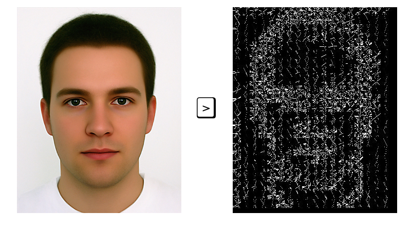

<p align="center">
    <a href="https://godoc.org/github.com/hihebark/gore">
        
    </a>
    <a href="https://goreportcard.com/report/github.com/hihebark/gore">
        
    </a>
    <a href="https://github.com/hihebark/gore/blob/master/LICENSE">
        
    </a>
</p>
<p align="center"></p>

gore
=====

Gore is a project to implement various image processing like HOG (Histogram of Oriented Gradients) and saliency and others. In the first place it was just to detect face and use only hog algorithm but i did find an interset about image processing (how a computer see an image it's a blowing mind).

For more thechnique i dide use those documentation:

* HOG [Histogram of Oriented Gradients - Wiki](https://en.wikipedia.org/wiki/Histogram_of_oriented_gradients):
  * [Machine Learning is Fun! Part 4: Modern Face Recognition with Deep Learning](https://medium.com/@ageitgey/machine-learning-is-fun-part-4-modern-face-recognition-with-deep-learning-c3cffc121d78)
  * [HOG Person Detector Tutorial](http://mccormickml.com/2013/05/09/hog-person-detector-tutorial/)
  * [Gradient Vectors](http://mccormickml.com/2013/05/07/gradient-vectors/)
* Saliency map [Saliency - Wiki](https://en.wikipedia.org/wiki/Saliency_map) and based on Itti model [AN IMPROVED SALIENCY DETECTION ALGORITHM BASED ON ITTI’S MODEL](https://hrcak.srce.hr/file/193994):
  * https://www.hindawi.com/journals/cin/2016/6749325/
  * RGB -> CIELab
  * Features: Intensity, Color, Orientation
  * Wavelet pyramid: Intensity, Color, Orientation
  * Conspicuity: Intensity, Color, Orientation
  * Gabor explanation: [Gabor filter for image processing and computer vision](http://matlabserver.cs.rug.nl/edgedetectionweb/web/edgedetection_params.html)

##### Result so far
* Using HOG implementation.
<p align="center"></p>

##### Usage

```
$ ./gore -h

  ┏ ┳ ┓
  ┣ o ┫
  ┗ ┻ ┛
  Gore - 0.0.1
Usage of ./gore:
  -model string
        Model to use hog, sal, ...
  -p string
        Path to the image.
```

##### Example

```
$ ./gore -p data/face.jpg
  ┏ ┳ ┓                                    
  ┣ o ┫
  ┗ ┻ ┛
  Gore - 0.0.1
+ Grascaling image ...
+ There is 422 cells
- Processing with 413 cell
+ Saving hog-face.gore.jpeg

```
---

<p align="center"><i>Made with </i>■ <i>by <b><a href="https://github.com/hihebark">hihebark</a></b></i></p>
